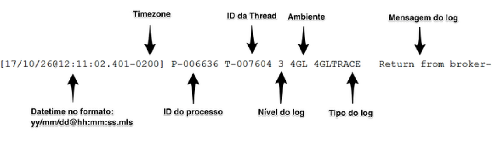

Como utilizar todo o potencial do clientlog no Progress OpenEdge 

1 of 7 

Como utilizar todo o potencial do clientlog no Progress OpenEdge 

Marcelo Assreuy Nov 23, 2017 3 min read 

## Como utilizar todo o potencial do clientlog no Progress OpenEdge 

**Todo mundo que trabalha ou trabalhou com Progress já passou pela necessidade de encontrar algum problema ou saber exatamente o que ocorreu em determinado ponto do programa.** 

O _debug_ �ca ainda mais complicado quando não temos acesso ao código fonte. Para estes casos, o Progress possui o clientlog, um recurso muito conhecido e utilizado. Sempre que precisamos de bate e pronto de ativar o clientlog, uma colinha é sempre bem-vinda. 

O objetivo deste post é deixar uma consulta rápida de como ativar o clientlog no Progress Openedge e passar diversas dicas sobre como utiliza-lo de uma maneira mais prática. 

## **Como funciona** 

O clientlog pode ser ativado inserindo parâmetros na PF ou em tempo de execução através do LogManager. Ele sempre vai funcionar da mesma maneira, independente da forma que for habilitado, o que muda é a sintaxe utilizada em cada caso. 

Você pode utilizar o log de diversas formas e para diferentes objetivos. Eu separei um exemplo que vai atender a maioria dos casos, mesmo assim para situações especí�cas, consulte a documentação o�cial. 

## **Progress clientlog via PF** 

Habilitar o log pela PF é simples, você precisa apenas inserir os seguintes parâmetros no seu arquivo de conexão: 

## **Ativar** 

- debugalert 

clientlog c:\tmp\clientlog txt 

clearlog 

2 of 7 

Como utilizar todo o potencial do clientlog no Progress OpenEdge 

- -clientlog c:\tmp\clientlog.txt -clearlog 

- -logginglevel 4 

- logentrytypes 

4GLMessages,4GLTrace,DB.Connects,DynObjects.DB,DynObjects.XML,DynObject 

s.Other,DynObjects.CLASS,DynObjects.UI,FileID,ProEvents.UI.CHAR,ProEven ts.UI.COMMAND,ProEvents.Other,SAX 

A principal vantagem de se utilizar via PF é que quando a conexão é iniciada, todas as atividades já são gravadas no log. 

A desvantagem é que você precisara alterar o arquivo .PF ou criar um arquivo exclusivo para o clientlog. **Atenção!** Cuidado com o tamanho do log pois ele pode crescer muito rapidamente! Falarei sobre isto mais adiante. 

## **Progress clientlog em tempo de execução via LogManager** 

O Progress possui um recurso chamado LogManager que fornece uma série de métodos para trabalhar com logs. Usar o LogManager é muito simples, você precisa apenas abrir o editor (_edit.p) e executar o seguinte código: 

## **Ativar** 

SESSION:DEBUG-ALERT = YES. LOG-MANAGER:LOGFILE-NAME = "c:\tmp\clientlog.txt". LOG-MANAGER:LOGGING-LEVEL = 4. LOG-MANAGER:LOG-ENTRY-TYPES = 

"4GLMessages,4GLTrace,DB.Connects,DynObjects.DB,DynObjects.XML,DynObjec ts.Other,DynObjects.CLASS,DynObjects.UI,FileID,ProEvents.UI.CHAR,ProEve nts.UI.COMMAND,ProEvents.Other,SAX". 

## **Desativar** 

3 of 7 

Como utilizar todo o potencial do clientlog no Progress OpenEdge 

SESSION:DEBUG-ALERT = NO. LOG-MANAGER:CLOSE-LOG(). 

A principal vantagem é não precisar alterar nada no PF nem em qualquer outro arquivo de con�guração. Você pode inclusive criar um programa que ativa ou desativa o clientlog. Outra grande vantagem é a facilidade em depurar apenas uma pequena parte da aplicação. 

## **Detalhe de cada parâmetro** 

Para que serve cada um destes parâmetros dos exemplos acima? 

|**Via PF**|**Via LogManager**|**Para que serve?**||
|---|---|---|---|
|-debugalert|SESSION:DEBUG-ALERT|Caso o Progress retorne algum erro, tod a pilha de execução até o erro será exibida no log.||
|-logginglevel|LOG-MANAGER:LOGGING- LEVEL|Determina o nível de detalhamento do log, onde: **0-**None - Não loga nada **1-**Errors - Somente erros Progress **2-**Basic - Somente log básico **3-**Verbose - Modo verbose dos valores de�nidos no logentrytypes **4-**Extended - Modo extendido dos valores de�nidos no logentrytypes||
|-logentrytypes|LOG-MANAGER:LOG-ENTRY- TYPES|Tipos de eventos que serão exibidos no log de acordo com o logginglevel de�nido. Um detalhe de todas as opçõe estão disponíveis no �nal deste post.||
|-clientlog|LOG-MANAGER:LOGFILE-NAME|Caminho e nome do arquivo do log que será gerado||

**Estrutura do Log** 

4 of 7 

Como utilizar todo o potencial do clientlog no Progress OpenEdge 

## **Estrutura do Log** 

O log do Progres tem uma estrutura própria com data, cabeçalho e o conteúdo da mensagem. Veja o que signi�ca cada parte desta estrutura: 

## **Dicas** 

Algumas sacadas sobre o uso do clientlog. 

## **Mudar o nível de detalhamento** 

Se você ativou o clientlog via PF, você ainda sim pode utilizar o LogManager. Neste caso o Progress deixará de manipular o log de�nido na PF e utilizará os parâmetros e de�nições do LogManager. Isto é muito útil para aumentar ou diminuir o detalhamento e para mudar o caminho e nome do arquivo de log. 

## **Tamanho do arquivo** 

Como falei acima, é preciso tomar cuidado com o tamanho do log pois o arquivo cresce muito rápido, princialmente se você de�niu o log para modo _extended_ . Uma maneira de contornar isto é utilizar o método que sobreescreve o arquivo sempre que uma nova sessão for iniciada, pois, o padrão do Progress é nunca sobreescrever. 

• **Via PF** 

Insira o parametro _clearlog_ após o nome do log Exemplo: 

5 of 7 

Como utilizar todo o potencial do clientlog no Progress OpenEdge 

Insira o parametro _-clearlog_ após o nome do log. Exemplo: 

## -clientlog clientlog.txt -clearlog 

## • **Em tempo de execução via LogManager** 

Após iniciado e de�nido o log pelo LogManager, execute o seguinte método: 

LOG-MANAGER:CLEAR-LOG( ) 

## **Escrever direto no log** 

Uma outra coisa legal é que você não precisa �car dando _MESSAGE "passou aqui" VIEW-AS ALERT-BOX_ no programa. Coloque as suas mensagens para saírem diretamente no clientlog. Para isto, após ativado o clientlog, execute o seguinte método: 

LOG-MANAGER:WRITE-MESSAGE("passou aqui"). 

## **Especi�cação de cada função do clientlog** 

|**Atributo**|**Para que serve?**|**Nivel do log**||
|---|---|---|---|
|4GLMessages|Escreve no log todas os MESSAGE com VIEW-AS ALERT-BOX.|2 - Basic||
|4GLTrace|Escreve no log as chamadas de RUN, PUBLISH, FUNCTIONS, and SUBSCRIBE e funções especi�cas.|2 - Basic ou superior||
||Escreve no log o quando uma   |||
|4GLT|ã i f i|2 B i i||
|||||

6 of 7 

Como utilizar todo o potencial do clientlog no Progress OpenEdge 

|p  g  g|pg p.p.|2 - Basic ou superior p|2 - Basic ou superior p|
|---|---|---|---|
|4GLTrans|transação começou, terminou ou foi desfeita.|2 - Basic ou superior||
|DB.Connects|Escreve no log as aberturas e fechamentos de conexão com o bando de dados, incluindo o nome e id do usuário.|2 - Basic ou superior||
|DynObjects.DB DynObjects.XML DynObjects.Other DynObjects.UI|Escreve no log a criação e remoção de qualquer tipo de objeto dinâmico.|2 - Basic 3 - Verbose para detalhes da pilha||
|FileID|Escreve no log a abertura, fechamento e erros de programas e arquivos.|2 - Basic e superior||
|ProEvents.UI.Char ProEvents.UI.Command ProEvents.Other|Escreve no log todos os eventos Progress de todas as categorias|2 - Basic ou superior||
|SAX|Escreve no log as chamadas SAX. SAX é um parser de XML.|2 - Basic||

Espero ter ajudado! Nos avisem caso tenha alguma observação, comentário ou correção! 

7 of 7 

